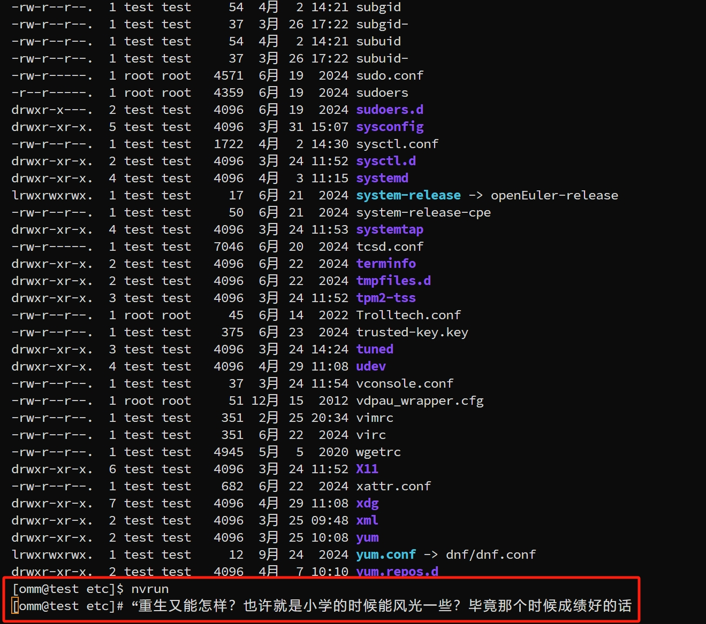
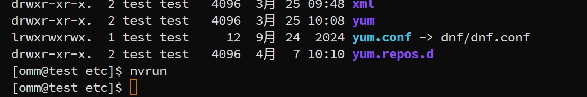
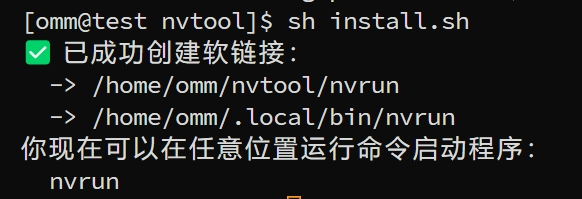
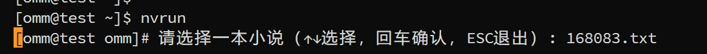

# nvtool

#### 介绍
linux超隐蔽看小说摸鱼小工具

按下esc即可毫无痕迹的关闭

#### 安装教程
1.  首先git clone本仓库到你的目录下
2.  然后执行 sh install.sh脚本，请保证有足够的权限，若有以下提示则说明可以使用

#### 使用说明
ps:在使用前请将txt格式的小说文件放在text目录下

当你将环境变量刷新后就可以在当前用户下的任何目录下执行nvrun命令，如下图所示：
 
然后你就可以根据小说名称进行选择

up是上一行，down是下一行，b是返回上一级，esc为退出
#### 功能说明
1.本脚本支持小说的记忆功能 

2.本脚本无论在任何阶段只要按esc都可以毫无痕迹的退出

3.本脚本任何操作都在一行操作，旨在隐蔽，方便
#### 架构说明
text目录用于存放小说文件
nvpgs目录用于存放阅读的历史记录

#### 改善计划
1.自定义换行按键

* ps: 
text中有两本用于测试的不同名但内容相同的小说（我的女友来自未来！），请自行删除，或者看也可以，还是很好看的